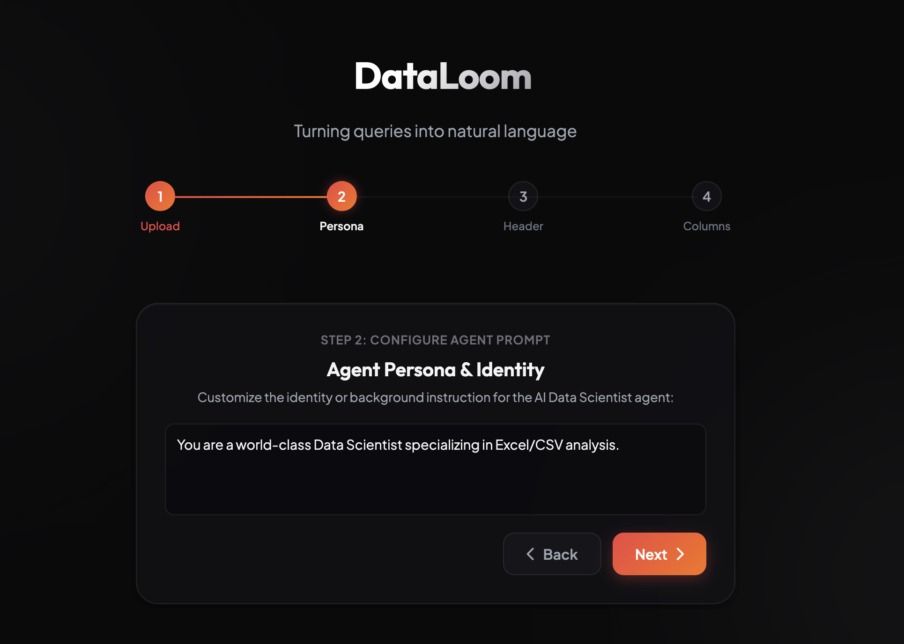
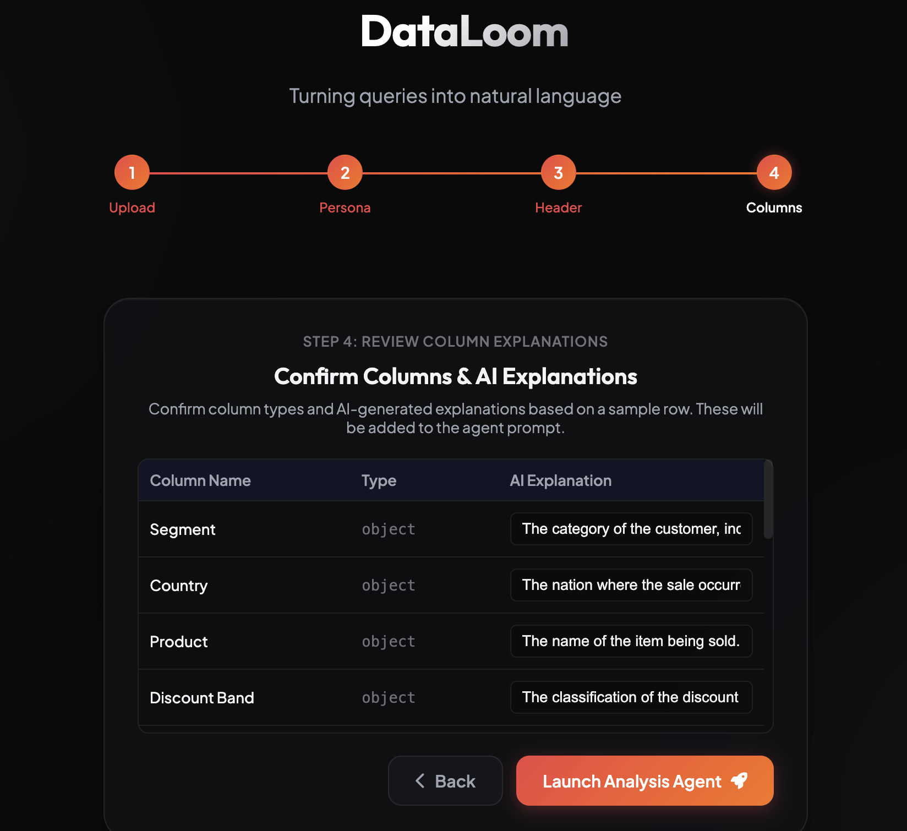
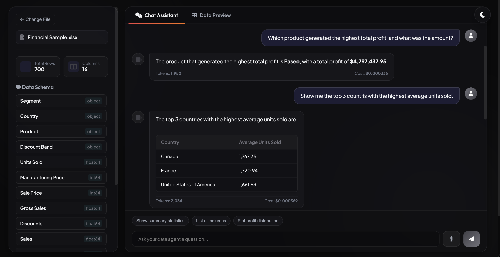
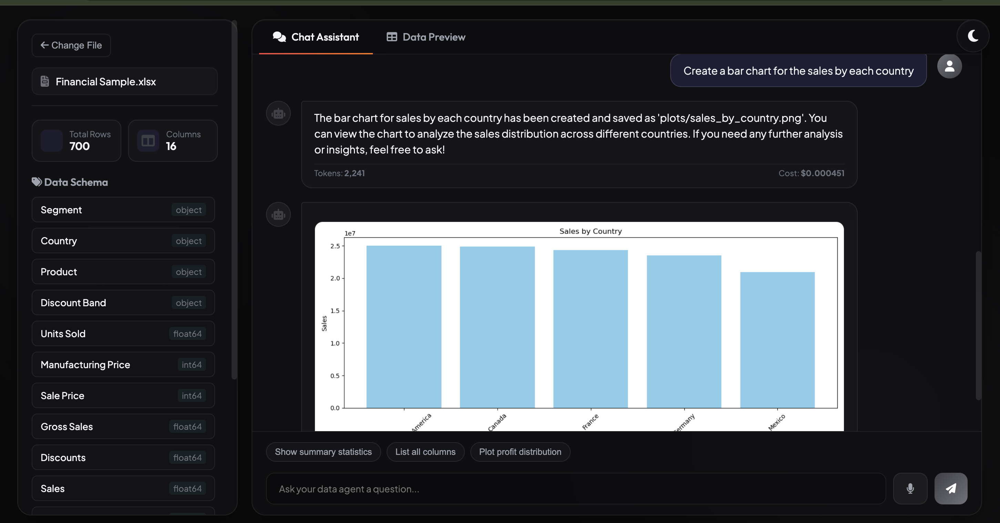

# schema-to-script-agent: A Private, Cost-Effective AI Data Analyst

> **Get answers to any complex query from your Excel spreadsheets or Databases within seconds—for only a fraction of a cent per query.**

An intelligent, natural language Q&A interface for querying spreadsheets (Excel, CSV) and SQLite databases. This project goes beyond basic data chatbots by utilizing a **hybrid execution architecture** that saves up to 98% in LLM token costs, completely eliminates math hallucinations, and keeps your raw data private. It also features dynamic visualization generation.

## The Problem: The "Naive" AI Data Approach

Most companies integrate AI with their data by feeding massive spreadsheets or entire databases directly into LLM context windows. 

* **Astronomical Costs**: Feeding 450,000 cells of raw data into a prompt uses millions of tokens per query, leading to exorbitant API bills.
* **Severe Hallucinations**: Standard AI models lose precision with large context windows, frequently making calculation mistakes or hallucinating metrics.
* **Data Privacy Risks**: Your entire business dataset is transmitted directly to external AI servers.

## The Solution: Under the Hood

Instead of feeding the entire sheet to the AI, this bot separates **cognitive reasoning** from **data execution**:

1. **Automated Schema Analysis**: Extracts only high-level metadata (column names, types, descriptions) from your data.
2. **Writing Logic, Not Answers**: The AI receives this lightweight schema (under 1,000 tokens) and writes a precise Python script or SQL query.
3. **Secure Local Execution**: The generated script runs locally in a secure, sandboxed environment against your full dataset.
4. **Clean Results**: The local engine returns only the final aggregated result or a small summary table.
5. **No Hallucinations**: Since a deterministic local computation engine executes the math, there is zero room for AI calculation errors.

## Core Features

1. **Spreadsheet Q&A**: Upload any CSV or Excel file, automatically detect column headers, and query the dataset using plain English.
2. **Database Q&A**: Upload/Connect a SQLite database file, auto-catalog tables/schemas, and execute read-only SQL queries deterministically.
3. **Automated Visualization**: Ask the agent to plot a chart (e.g., "plot profit by country"), and it will generate, save, and render the chart dynamically.
4. **Policy Search**: Semantic retrieval for unstructured company PDF manuals (HR guidelines, quality manual CBP/LQSM, etc.) powered by Chroma vector database.
5. **Voice Input Integration**: Query your data hands-free using the voice button in the chatbot, translating speech to text locally in the browser.

## How It Works in Action

**Step 1: Upload your Data**
Just enter the Excel file or connect your SQL database.

**Step 2: Automated Schema Analysis**
The AI will itself determine the column names from the file and generate a precise description for each column, which you can edit if needed.

**Step 3: Ask Complex Questions**
You can see the token usage and cost (which is extremely minimal) alongside the generated query. Even with typos (like spelling countries wrong), it is smart enough to understand your intent and write the correct code instantly!

**Step 4: Generate Visualizations**
Need a chart? It can generate beautiful graphs and charts on the fly based on your data.

> **💡 The Best Part:** The AI has no idea about the actual rows of data in your file. It only sees the schema. Yet, it gives a precise, 100% accurate mathematical answer, and the entire response comes back within just 6-7 seconds!

## Scalability & Production Infrastructure Costs

When deploying this application to production, standard compute costs apply. In addition to FastAPI web server and database hosting:
* **Isolated Data Containers**: To scale the application to handle multiple simultaneous user requests without memory or data state conflicts, we require containerized sandboxes (e.g., Docker containers or micro-VMs).
* **In-Memory Store Isolation**: Each user session loads its spreadsheet/database into its own dedicated in-memory container store. This ensures the AI can write code to query and read from the store independently, guaranteeing strict data isolation, privacy, and concurrent request processing.

## Tech Stack

* **Backend**: FastAPI (Python)
* **AI Orchestration**: LangGraph, LangChain Core
* **Models**: OpenAI GPT-4o-mini (Query Interpretation & Script Generation), OpenAI `text-embedding-3-large` (Manual Embeddings)
* **Local Engines**: Pandas (for spreadsheet analysis), Matplotlib/Seaborn (for charting), SQLite (for database queries)
* **Vector Store**: Chroma DB

## Architecture Comparison

| Feature | The Old Way (Uploading Full Sheet) | This Q&A Bot |
| :--- | :--- | :--- |
| **Token API Cost** | Astronomical (450,000+ cells in context) | **Ultra-Low** (Schema only, under 1,000 tokens) |
| **Hosting & Infrastructure** | Free (running on standard web chat interfaces) | **Predictable Flat-Rate Container Hosting** |
| **Concurrency & Scaling** | Serialized / limited by model rate limits | **Parallel & Isolated** via Containers |
| **Data Size Limit** | Highly limited by AI context windows | **Unlimited** (handles millions of rows locally) |
| **Calculation Accuracy** | High chance of AI math hallucinations | **100% Accurate** (executed deterministically) |
| **Data Privacy** | Full raw dataset transmitted to AI servers | Only **schemas and aggregated results** sent |
| **Visualizations** | Manual Excel charting / pivot tables | **Automated** natural language chart generation |

---
*Built with ❤️ to turn data access from a bottleneck into a superpower.*
